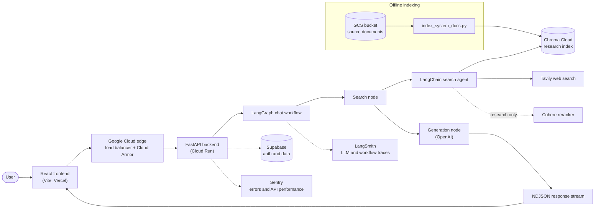

# Arcel: Strength & Conditioning Assistant

Arcel is a full-stack assistant for hybrid athletes building strength and conditioning programs around sport-specific demands. It answers conversational and research-backed training questions using more than 300 CC BY 4.0 research papers, live web search, and streamed LLM generation.

The React/Vite frontend is deployed on Vercel, while the containerized FastAPI backend runs on Google Cloud Run behind Google Cloud Load Balancing and Cloud Armor. The backend uses LangGraph for request-level workflow orchestration, a LangChain search agent for evidence gathering, OpenAI for model inference, Chroma Cloud for research retrieval, Tavily for web search, Cohere for optional research-only reranking, and Supabase for authentication and application data.

## Architecture



## LangGraph workflows

LangGraph coordinates the application-level AI workflow. The current chat graph is compiled once during FastAPI startup and reused for incoming requests:

```text
START -> search -> generate -> END
```

The graph carries messages, retrieved sources, and the generated answer in its state. Request-specific identity and authentication values are passed separately through `WorkflowContext`, so credentials are not persisted as graph state.

The search node invokes a reusable LangChain agent that can query the Chroma research collection and Tavily web search. It may reformulate weak searches and can rerank research results with Cohere. The generation node receives the selected evidence and streams model tokens through LangGraph to the FastAPI endpoint as newline-delimited JSON events.

The workout-planning graph lives under `server/app/ai/workflows/plan` and is being developed separately from the chat workflow. Shared model, search, and database integrations belong under `server/app/ai/services` rather than inside individual graphs.

See the official [LangGraph overview](https://docs.langchain.com/oss/python/langgraph/overview) and [streaming guide](https://docs.langchain.com/oss/python/langgraph/streaming) for framework details.

## LangSmith tracing

LangSmith provides traces for LangGraph nodes, LangChain agent steps, model calls, and tool calls. Because LangGraph and LangChain include LangSmith tracing hooks, no LangSmith-specific instrumentation is required for the current workflow. Tracing is enabled with environment variables:

```env
LANGSMITH_TRACING=true
LANGSMITH_API_KEY=...
LANGSMITH_PROJECT=arcel-development
```

`LANGSMITH_PROJECT` groups runs by environment or deployment. Use separate project names such as `arcel-development` and `arcel-production` so local traces do not mix with production traffic. Leave `LANGSMITH_TRACING` unset or set it to `false` to disable tracing.

LangSmith is used for AI-level observability, including workflow waterfalls, prompts, token usage, latency, tool inputs, and tool outputs. Sentry remains responsible for application exceptions, FastAPI transactions, and infrastructure-facing performance. Avoid sending secrets or unnecessary personal data in messages, tool payloads, tags, or metadata because traced values may be stored by the observability provider.

See the official [LangSmith observability quickstart](https://docs.langchain.com/langsmith/observability-quickstart) and [LangGraph tracing guide](https://docs.langchain.com/langsmith/trace-with-langgraph).

## Local development

Create `.env` from `.env.example` and provide credentials for the services you intend to use. LangSmith is optional, but OpenAI, Chroma, Tavily, Cohere, and Supabase are required by the current backend configuration.

Build the API image from the repository root:

```powershell
docker build -f server/Dockerfile -t arcel-backend .
```

Run the API:

```powershell
docker compose up --build api
```

Reindex the research collection:

```powershell
docker compose run --rm index
```

Run the client from `client/`:

```powershell
npm run dev
```
