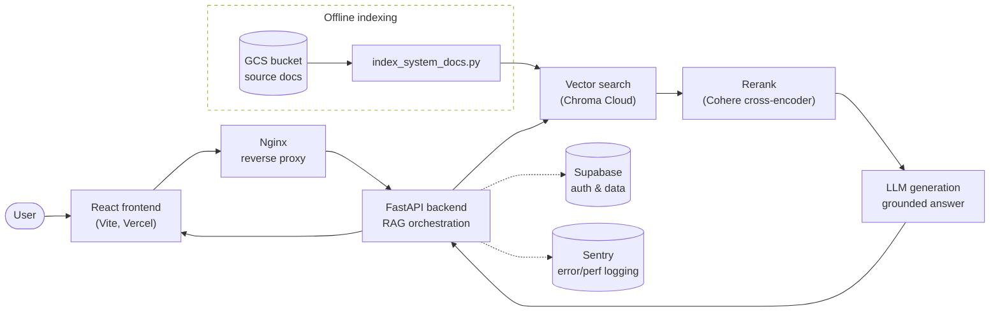

# Arcel: Strength & Conditioning RAG-based Assistant

Full-stack RAG assistant built for hybrid athletes who want to design strength and conditioning programs around sport-specific training demands while also having a consolidated source of research-backed performance information, servicing 300+ CC BY 4.0 research PDFs. The app supports natural-language training questions and structured workout planning, using a two-stage retrieval pipeline with Chroma vector search and Cohere cross-encoder reranking to surface more relevant source material before generating grounded responses. It combines a React/Vite frontend, FastAPI backend, OpenAI generation, Supabase auth/data services, Google Cloud Storage document ingestion, and Sentry observability, with Docker/Nginx infrastructure for production-oriented deployment.

---

---

Working on RAG eval, test suites, and CI/CD tooling...

---

### some dev services...

build api image from /
>> docker build -f server/Dockerfile -t arcel-backend .

run api behind nginx proxy from /
>> docker compose up --build proxy

run api server w/o proxy from /
>> docker compose up --build api-local

reindex with compose service
>> docker compose run --rm index

run client from /client
>> npm run dev
