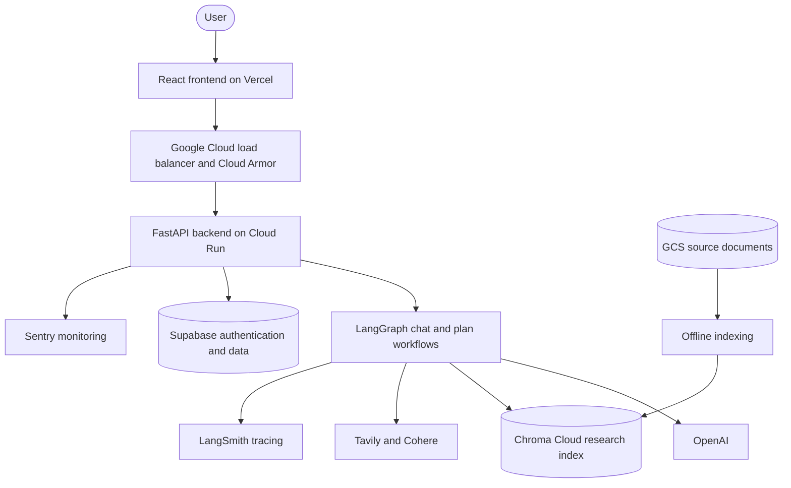
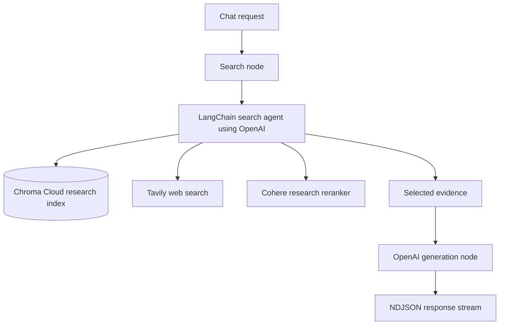
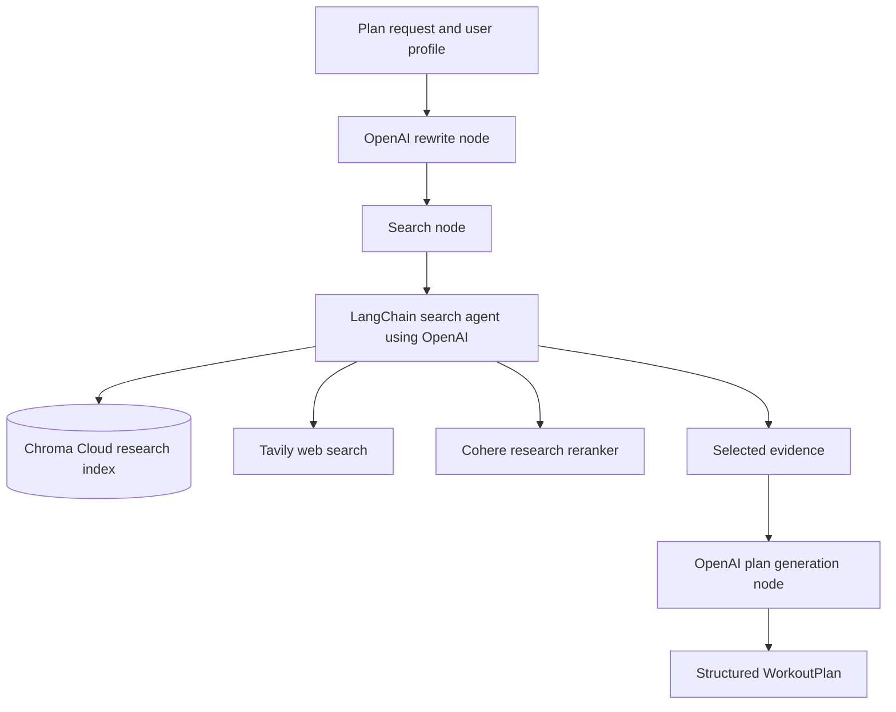

# Arcel: Strength & Conditioning Assistant

Arcel is a full-stack assistant for hybrid athletes building strength and conditioning programs around sport-specific demands. It answers conversational and research-backed training questions using more than 300 CC BY 4.0 research papers, live web search, and streamed LLM generation.

The React/Vite frontend is deployed on Vercel, while the containerized FastAPI backend runs on Google Cloud Run behind Google Cloud Load Balancing and Cloud Armor. The backend uses LangGraph for request-level workflow orchestration, a LangChain search agent for evidence gathering, OpenAI for model inference, Chroma Cloud for research retrieval, Tavily for web search, Cohere for optional research-only reranking, and Supabase for authentication and application data.

---
#### App Infrastructure

#### Chat LangGraph Workflow

#### Workout Programming LangGraph Workflow

---

### Local development services

build api image from /
>> docker build -f server/Dockerfile -t arcel-backend .

run api server from /
>> docker compose up --build api

reindex with compose service
>> docker compose run --rm index

run client from /client
>> npm run dev
